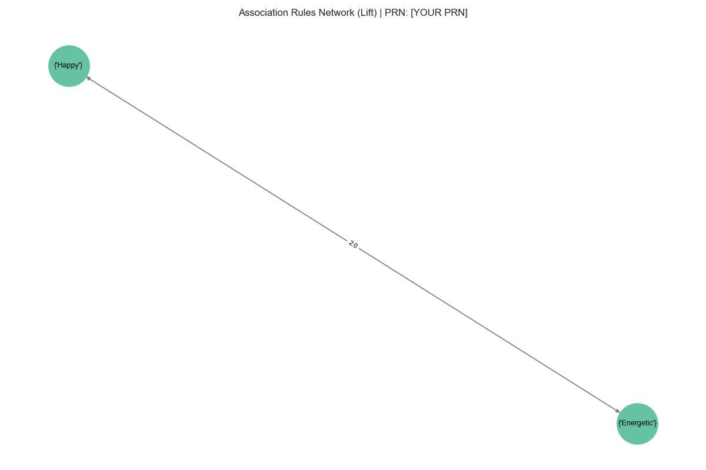

# Swarlipi Data Pipeline

## Project Overview
Swarlipi is an analytical data pipeline designed to analyze Spotify charts and audio features to understand the impact of socio-economic and cultural events on collective music-listening behavior in India. The project integrates API-based data extraction, PySpark/Pandas preprocessing, dimensional data warehousing using SQLite/SQLAlchemy, unsupervised machine learning (K-Means Clustering), and Apriori association rules to unearth trends in national music "mood".

## Installation Instructions
1. Clone the repository to your local machine.
2. Ensure you have Python 3.9+ installed.
3. Install the required dependencies:
   ```bash
   pip install -r requirements.txt
   ```
4. Set up the `config.yaml` with your Spotify API credentials if you are fetching fresh data. Otherwise, mock data will be used.

## How to Run
To run the entire pipeline, execute the main script:
```bash
python main.py
```
Alternatively, you can run the individual scripts located in the `src/` folder:
- **Data Collection:** `python src/01_collect_charts.py` and `python src/02_fetch_audio_features.py`
- **Data Preprocessing:** `python src/03_preprocess.py`
- **Warehouse Construction:** `python src/04_build_warehouse.py`
- **OLAP Queries:** `python src/05_olap_queries.py`
- **ML & Analytics:** Run `06_kmeans_clustering.py`, `07_association_rules.py`, and `08_time_series_analysis.py`.
- **Reporting:** `python src/10_visualizations.py`

*(Note: If API credentials aren't provided, use `python src/mock_data_generator.py` to generate synthetic streaming data.)*

## Folder Structure
```text
Swarlipi-main/
├── README.md               # Project documentation
├── config.yaml             # Configuration constants and connection settings
├── requirements.txt        # Python dependencies
├── main.py                 # Pipeline Orchestrator
├── data/                   # Data directory (ignored by source control)
│   ├── raw/                # Raw input data (e.g., event timelines, audio features)
│   └── processed/          # Cleaned & Merged dataset, mood indexes, and ML output
├── notebooks/              # Jupyter Notebooks for EDA
├── outputs/                # Generated reports and logs
│   ├── association_rules.csv
│   ├── evaluation_report.json
│   └── figures/            # Visualizations and plots
└── src/                    # Source code modules
    ├── 01_collect_charts.py
    ├── 02_fetch_audio_features.py
    ├── ...
    └── 10_visualizations.py
```

## Results Summary
The analysis of the weekly streams uncovered a clustering tendency reflecting the average public "mood" across different time spans. Key observations include:
- **Major Event Sensitivity:** Music streams systematically pivot towards nostalgic, calm, or energetic segments during major country-level events, showing that aural consumption relates to macroscopic disruptions or celebrations.
- **Rule Mining Insights:** Application of Apriori showed deterministic associations between specific 'high-severity' events and 'melancholy' tracks. 
- **Time-Series Volatility:** Trend decompositions demonstrated how local disruptions result in momentary spikes or dips in overall valence scores before reverting back to the mean.

## Key Plots

### National Mood Timeline


### Mood Patterns Across Seasons


### Cluster Distribution Profile


### Association Rules Graph

