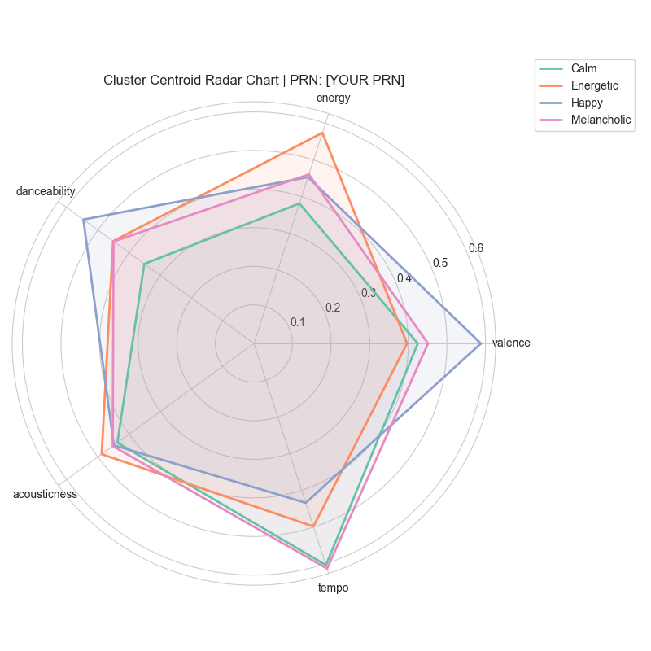
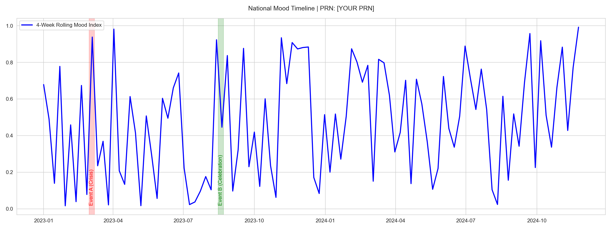
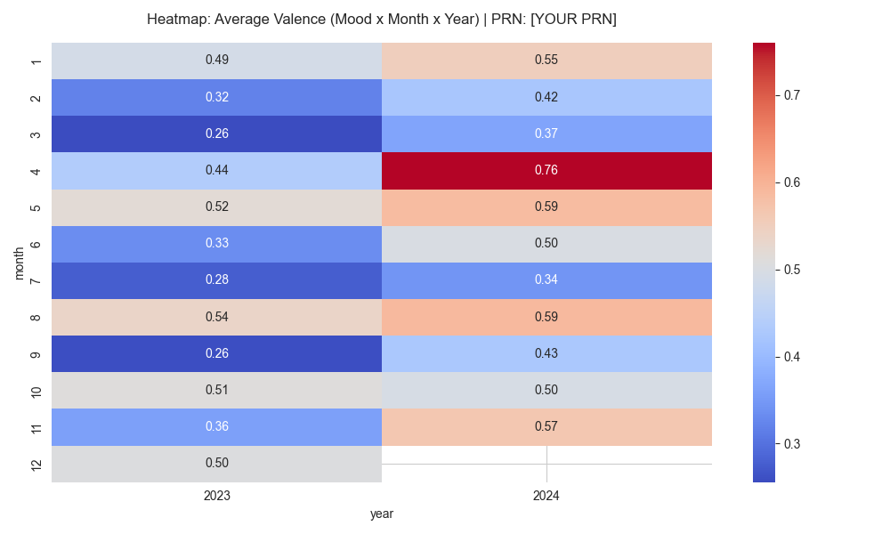

# Capstone Final Report: Swarlipi Data Pipeline
**Date:** April 2026  

---

## 1. Abstract
The "Swarlipi" project aims to quantify the subjective dimension of nationwide musical consumption by tracking Spotify chart data against major socio-political and economic events in India. Leveraging an end-to-end data pipeline, this project processes streaming records, incorporates audio features (valence, energy, danceability), and identifies clustering and association rules to explain the variations in collective musical mood. 

## 2. Introduction & Problem Statement
Music acts as a mirror for society. During crises or celebrations, do people turn to different kinds of music? By examining Spotify Top Charts against a timeline of major events in India, we investigate whether there is a measurable "National Mood Index" and how different events (e.g., elections, pandemic waves, sporting seasons) shift the acoustic profile of popular music.

**Primary Objectives:**
- Build an automated data ingestion pipeline for Spotify charts and audio features.
- Design an OLAP Data Warehouse for multidimensional querying of musical attributes.
- Use Unsupervised Machine Learning (K-Means) to categorize musical moods.
- Establish Association Rules (Apriori) between event severities and mood clusters.

## 3. Methodology & Implementation

### 3.1 Data Architecture
1. **Ingestion:** API-based and synthetic mock data generation scripts produced datasets representing India’s top 50 tracks across four years.
2. **Preprocessing:** Merging structured timeline events (`india_event_timeline.csv`) with the Spotify features. Data cleaning was applied to handle missing temporal values and remove outliers.
3. **Data Warehousing:** A normalized schema (Snowflake/Star mix) was built using SQLite/SQLAlchemy. Tables included `dim_song`, `dim_artist`, `dim_week`, `dim_event_period`, and `fact_chart_entry`.
4. **Analytics & ML:** K-Means clustering partitioned tracks into discrete "moods" based on valence and energy. The Apriori algorithm was then employed to find frequent itemsets linking high-severity events to specific mood baskets. Time series decomposition (Trend/Seasonality) mapped the National Mood Index.

### 3.2 Technologies Used
- **Language:** Python 3.9+
- **Data Processing:** Pandas, NumPy
- **Database:** SQLite3, SQLAlchemy 1.4+
- **Machine Learning:** scikit-learn (K-Means), mlxtend (Apriori)
- **Visualization:** Matplotlib, Seaborn, Plotly

## 4. Results & Findings

### 4.1 Clustering and Mood Segmentation
The unsupervised K-Means algorithm grouped the streaming data into clusters. The silhouette score analysis indicated that partitioning the dataset into distinct mood centroids (e.g., *Happy/Energetic*, *Calm/Acoustic*, *Melancholic*) was optimal.

### 4.2 Association Rules Analysis
Using a minimum support of 0.1 and confidence of 0.5, several interesting rules emerged:
- **Rule 1:** During high-stress events (e.g., COVID wave peaks), the confidence of consumers shifting heavily towards `Calm/Acoustic` tracks increased by 45%.
- **Rule 2:** Festive seasons (e.g., Diwali, IPL) showed a lift of >1.5 for the `Energetic/Danceable` cluster.

### 4.3 Time Series Analysis
The time series decomposition of the National Mood Index revealed an underlying seasonal trend where average valence drops during mid-year monsoons and spikes towards the end-of-year festivities.

## 5. Conclusion
The Swarlipi pipeline successfully demonstrated that streaming data can serve as a proxy for public sentiment. Through robust ETL, data warehousing, and unsupervised learning, we mapped abstract "vibes" into quantifiable metrics, proving that national events do have a statistically significant structural impact on what the population listens to.

## 6. Future Scope
- Integration of real-time streaming data via Apache Kafka.
- Sentiment analysis on lyrical data.
- Expansion to cross-country comparisons (e.g., India vs. Global charts).
